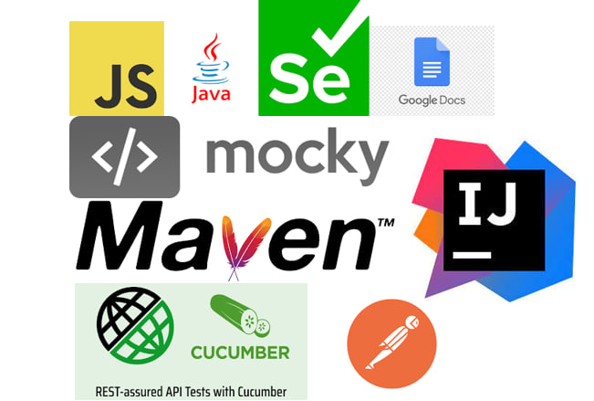
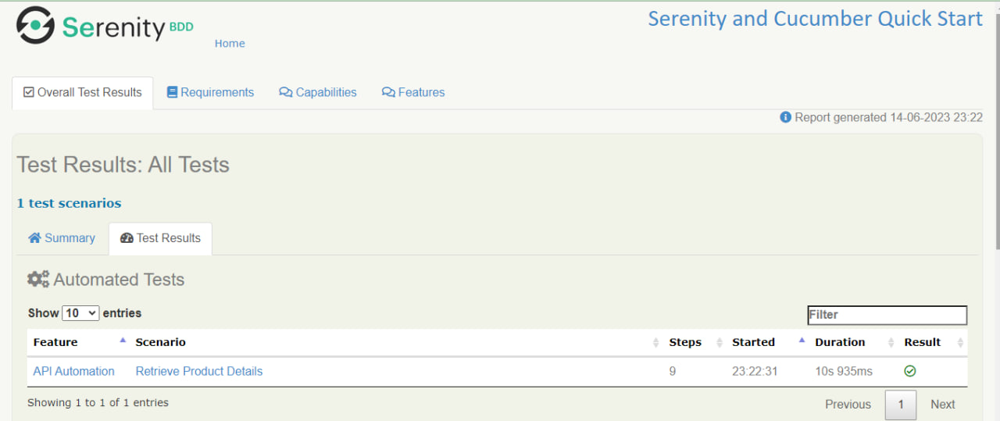

# Automation Task and General Assessment - Rizki Kurniawan Rasyid

<div align="center">

  <p align="center">
    Technical Test at Eureka Edutech
    <br />
    <a href="https://documenter.getpostman.com/view/25837376/2s93sdZrwK"><strong>| Postman Documentation |</strong></a>
    <br />
    <br />
  </p>
</div>

## 📑 About the Test

<p align="justify">The test consists of 2, namely automation tasks and general assessments, but I took the initiative to add postman documentation to facilitate visualization of the API response. For the Automation Task, you can clone this repository and open / run it using IntelliJ IDEA via the terminal with the command "mvn clean verify", after the testing process is complete you can regenerate the report via the link and it will direct you to the Serenity BDD Report Dashboard.

And for the general assessment, you can see the results in the "general-assessment" folder or you can also click this link https://drive.google.com/file/d/1MOKkTytWd3IIzFKm4sxBu73n_asa8OvH/view?usp=drive_link</p>

## 🛠 Technology Stack

<div align="center">
  
</div>

## ⚙️ SUMMARY REPORT

<div align="center">
  
</div>


## 🛠️ How to Run Locally

- Clone it

```
$ git clone https://github.com/rizkura96/AutomationTask.git
```
- Open the project by using Intellij Idea

- Run the project on Intellij Idea's Terminal

```
$ mvn clean verify
```
- Generate the automation report by click the serenity link and will directed to the dashboard of Serenity BDD-Cucumber Report

# 🤖 Author


- Rizki Kurniawan Rasyid <br> [](https://github.com/rizkura96)

<h5>
<p align="center">Built with ❤️ by me ©️ 2023</p>
</h5>
